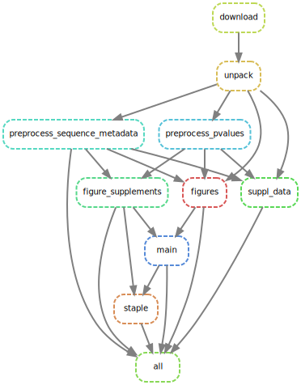

# Geo-htseq-paper

We analyzed the field of expression profiling by high throughput sequencing, or RNA-seq, in terms of replicability and reproducibility, using data from the GEO (Gene Expression Omnibus) repository. Our work puts an upper bound of 56% to field-wide reproducibility, based on the types of files submitted to GEO. 

## Getting data

Got to <https://zenodo.org/record/3754095> and download data archive, let's say, to your Downloads folder. 

Then create new folder, e.g. "geo-htseq" and enter this folder

```bash
mkdir geo-htseq
cd geo-htseq
```

Copy downloaded dataset to your working directory and uncompress:

```bash
cp ~/Downloads/geo-htseq-until-2019-12-31.tar.gz .
tar -xzvf geo-htseq-until-2019-12-31.tar.gz
```

Remove tar.gz archive from working directory:

```bash
rm geo-htseq-until-2019-12-31.tar.gz
```

Now you should have dataset in "output" subdirectory ready for analysis.

## Workflow graph


